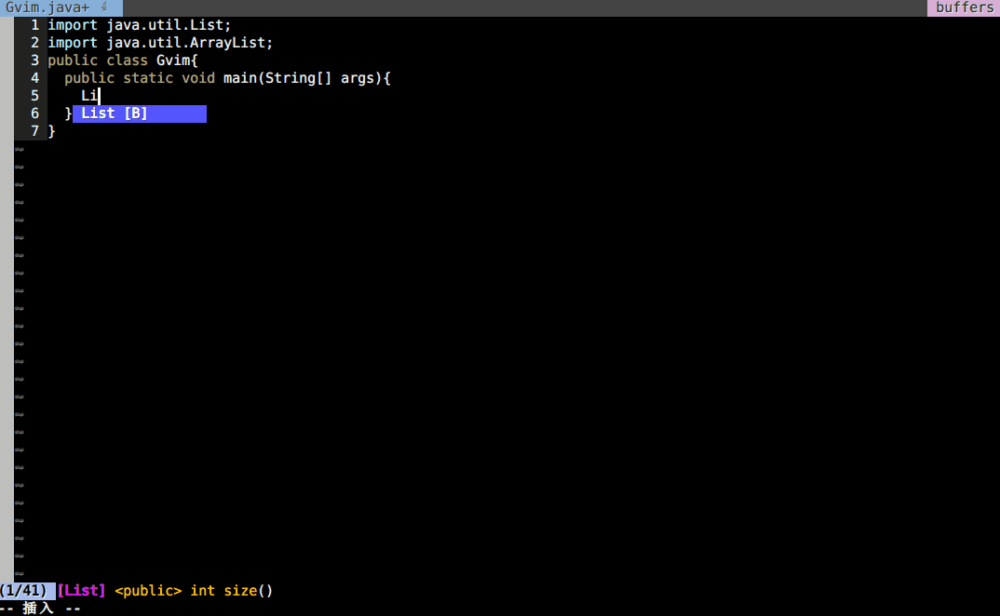
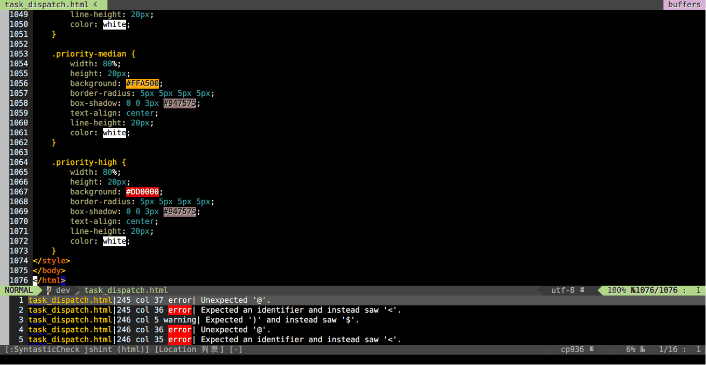
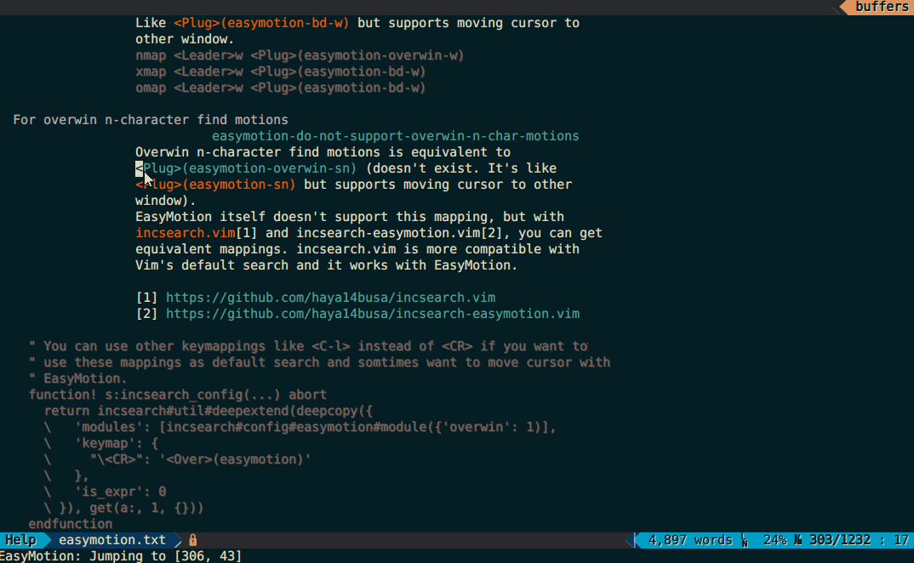
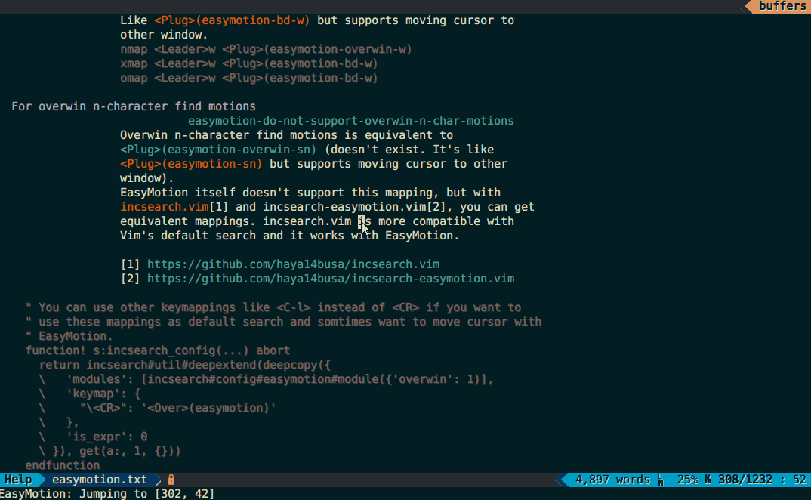

<b><a href="">philosophy</a></b>
|
<b><a href="#">for whom?</a></b>
|
<b><a href="#">screenshots</a></b>
|
<b><a href="#">documentation</a></b>
|
<b><a href="#">contribute</a></b>
|
<b><a href="#">achievements</a></b>
|
<b><a href="#">FAQ</a></b>

***

***

#支持的语言
* HTML
* JavaScript
* Python
* Go
* Ruby
* TypeScript
* Java
* Coffee
* Swift

#包含的功能
* 所支持语言的补全、语法高亮、缩进
* 模板补全
* 语法检查
* 缓冲区补全
* 有道翻译
* 书签、注解
* 状态行美化
* 文件图标
* 历史文件
* Git
* Markdown实时预览
* CSS Color
* Emmet
* Nerdtree
* Tagbar
* 撤销历史 
* 缓冲区文件列表
* 文件查找
* Vim操作符增强
* Vim动作命令增强
* 快速添加注释
* 全屏切换
* 代码格式优化
* 代码折叠
* 缓冲区文件快速切换
* Vim与系统共用剪切板

#准备
1. Vim 8.0(+) with Vundle
2. [安装字体补丁](https://github.com/powerline/fonts)
3. Python 2.7(+)、Python 3.5(+)、Lua 5.1(+)
4. git

#配置

* Windows用户

1. 备份配置文件
2. git clone https://github.com/netgather/vim-config.git
3. 替换_vimrc
4. 将_vimrc中有关的目录替换成你的目录
5. 替换gvim.exe
6. 启动Gvim
7. 运行：PluginInstall

* Linux用户

1. 备份配置文件
2. 替换_vimrc
3. 将_vimrc中有关的目录替换成你的目录
4. Vim下运行PluginInstall

#效果

#功能

##全屏（适用于Windows用户）
> 全屏切换：`F11`

##状态行
>格式：当前模式>分支或拼写检查>文件名  ...  文件编码<当前行百分比 当前行/所有行 当前列

##文件列表
>普通模式下输入 `nt`

##翻译
> 翻译单词 

* 普通模式：将光标至于要翻译的单词上 按下 `<Ctrl-t>`
* 可视模式：选中单词 按下`<Ctrl-t>`

> 翻译句子

* 可视模式：选中要翻译的句子 按下`<Ctrl-t>`

##语法检查
> 当打开文件时 Vim会检查当前文件中是否有语法错误，在Quickfix列表中错误的详细信息，并在侧边栏中给出错误标识

##Tagbar
> 普通模式：按下`tb`

##书签
> 普通模式： 按下`mm`会在当前行增加一个书签 "⚑"，以便以后快速跳转回来

##注解
> 普通模式： 按下`mi`会在当前行增加一个注解"✎"，用于在当前行增加一个tips

##显示全部的书签和注解
> 普通模式： 按下`ma`会显示出全部的注解和书签，回车即可跳到对应位置

##日历
> 命令模式：输入`Calendar`

##查找文件
> 命令模式：输入`CtrlP`

##查找缓冲区
> 命令模式：输入`CtrlPBuffer`

##查找最近使用的文件
> 命令模式：输入`CtrlPMRU`

##Markdown
> 命令模式：输入`MarkdownPreview`

##Java补全
> 开发Java最好还是使用集成开发环境，因此你可以去掉_vimrc中有关Java的插件

##CSS Color

##快速跳转

> 该功能类似于Chrome中的Vimium插件提供的功能

>光标前向跳转 ： 普通模式下：“空格 + w”

>光标后向跳转 ：普通模式下： “空格 + b”

#To be continued......

